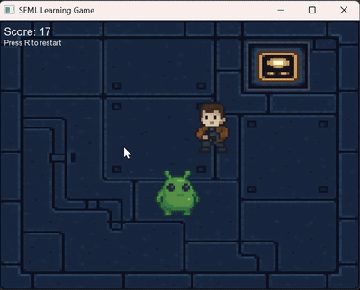

# Game Projects Repository

This repository contains small game projects created as part of learning exercises. The games are organized into directories based on their technology stack:

## Directories
### `SFML games`
Contains games that use SFML graphic framework
- Pacman

### `c terminal games`
Contains simple console-based games written in C#.
- Includes text-based games like a Fighting game and Tic-Tac-Toe.  
- Utilizes basic C# constructs such as `if/else`, `while`, and `switch` statements.

### `pong game`
Contains a Pong game implemented using the [LOVE2D](https://love2d.org/) framework.  
- A classic Pong clone demonstrating simple 2D game mechanics with Lua scripting.
