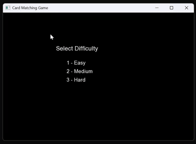

# Game Projects Repository

This repository contains small game projects created as part of learning exercises. The games are organized into directories based on their technology stack:

## Directories
### `SFML games`
Contains games that use SFML graphic framework
- Pacman

- FindCouple
Find the Pair is a quick memory game where you flip cards to match two of the same. Match all pairs to win!

### `pong game`
Contains a Pong game implemented using the [LOVE2D](https://love2d.org/) framework.  
- A classic Pong clone demonstrating simple 2D game mechanics with Lua scripting.

### `c terminal games`
Contains simple console-based games written in C#.
- Includes text-based games like a Fighting game, Tic-Tac-Toe, Snake
