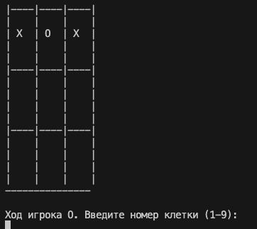

# Console Terminal Games (Skillfactory Homework)

This repository contains simple text-based games written in C# for the **Skillfactory** programming course. Each game demonstrates basic C# syntax and control structures, including `if`, `else`, `while`, and `switch` statements.

## 📁 Folder Structure

All game files are located in the `Games` folder. Each file is a complete, self-contained C# console application.

## 🕹 Games Included

### 1. Console Fighting Game (`FightingGame.cs`)
A turn-based combat simulator where you face off against a computer virus. You manage your health and energy, choosing actions like cleaning the Temp folder or drinking coffee. The virus also takes turns attacking or restoring its energy. The game ends when either you or the virus is defeated.

**Features:**
- Health and energy system
- Turn-based logic
- Player actions with consequences
- Enemy AI with randomized behavior

### 2. Tic-Tac-Toe (`TicTacToe.cs`)
A console-based implementation of the classic Tic-Tac-Toe game for two players. The board is visualized with lines and each move is selected by entering a number from 1 to 9.

**Features:**
- Visual board using ASCII drawing
- Input validation
- Win and draw detection
- Dynamic grid rendering using coordinates

