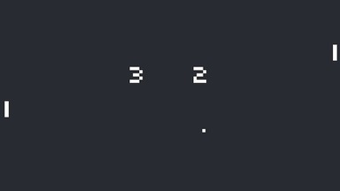

This code implements a classic Pong game using the LÖVE 2D framework in Lua.

It defines key components such as the Ball and Paddle as classes, handles game state transitions (start, serve, play, victory), and manages player input and AI for paddle movement. 

The Ball class controls the ball’s position, velocity, collision detection, and rendering.

The main game loop updates the game state, checks collisions between ball and paddles or screen edges, updates scores, and renders the game visuals, including scores, messages, and FPS. The game supports playing against another player or a simple AI, with sound effects for paddle hits, wall hits, and scoring.

